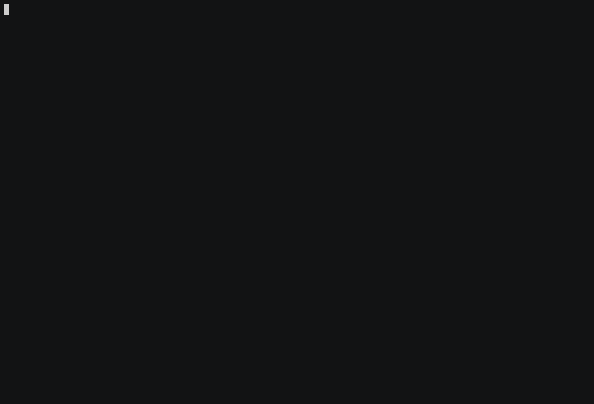

## Slutavstämning Programmering 1: Weather-o-matic

### Skärminspelning

Du kommer spela in din skärm under avstämningen. Installera [Sharex (https://getsharex.com/)](https://getsharex.com/).

När Sharex installerats, tryck på pilen till höger om “Capture” i den vänstra panelen, och välj ”Screen Recording”. Sharex kommer nu ladda ner och installera FFmpeg (en videokomprimerare). 

När FFmpeg installerats kan du börja spela in skärmen.

I task-baren längst ner i windows ser du till höger en röd plupp. När du är klar med uppgiften klickar du på pluppen för att avsluta inspelningen.

Filmen sparas i mp4-formatet. I Classroom finnas en separat inlämningsuppgift där du laddar upp filmen senast ett dygn efter provets slut.

## Bedömningsmatris

#### Planering & Problemanalys

| E                                                            | C                                                            | A                                                            |
| ------------------------------------------------------------ | ------------------------------------------------------------ | ------------------------------------------------------------ |
| **Tillsammans** med läraren analyserar du  **enkla** problem och planerar dina lösningar med **enkla** flödesscheman. | **Med läraren som bollplank** analyserar du  **lite mer avancerade** problem och planerar **utförligt** dina lösningar med flödesscheman. | **Med läraren som bollplank** analyserar du **avancerade** problem och planerar **utförligt**  dina lösningar med flödesscheman. |

* Har du delat upp problemet i flera delproblem?
* Har du en välstrukturerad lösning med flera funktioner?

#### Implementering & Felsökning

| E                                                            | C                                                            | A                                                            |
| ------------------------------------------------------------ | ------------------------------------------------------------ | ------------------------------------------------------------ |
| **Tillsammans** med läraren implementerar du lämpliga verktyg  och felsöker **enkla** syntaxfel. | **Med läraren som bollplank** implementerar du lämpliga verktyg och felsöker **systematiskt** syntaxfel, körtidsfel och logiska fel. | **Med läraren som bollplank** implementerar du **med säkerhet** lämpliga verktyg och felsöker **systematiskt och effektivt** syntaxfel, körtidsfel och logiska fel. |

* Använde du debuggern?
* Läste du felmeddelanden?
* Testade du alla möjliga input?

#### Validering & Felhantering

| E                                                            | C                                                            | A                                                            |
| ------------------------------------------------------------ | ------------------------------------------------------------ | ------------------------------------------------------------ |
| **Tillsammans** med läraren validerar du indata och använder **enkla** felmeddelanden. | **Med läraren som bollplank** validerar du indata och använder **tydliga** felmeddelanden. | **Med läraren som bollplank** validerar du indata och använder **tydliga** felmeddelanden samt använder undantagshantering. |

* Vad händer om filen inte finns?
* Vad händer om filen är tom eller har felaktigt formaterad data?
* Vad händer om användaren väljer ett menyalternativ som inte finns?

#### Kommunikation & Dokumentation

| E                                                            | C                                                            | A                                                            |
| ------------------------------------------------------------ | ------------------------------------------------------------ | ------------------------------------------------------------ |
| **Tillsammans** med läraren skriver du tydlig och lättläst kod och kommenterar din kod. | **Med läraren som bollplank** skriver du tydlig och lättläst kod och dokumenterar din kod. | **Med läraren som bollplank** skriver du tydlig och lättläst kod och dokumenterar din kod utifrån en angiven standard. |

* Är all kod indenterad korrekt? 
* Är det tydliga variabel- och funktionsnamn?
* Är det någon rad som gör för mycket? 
* Är alla funktioner dokumenterade?

#### Utvärdering & Optimering

| E                                                            | C                                                            | A                                                            |
| ------------------------------------------------------------ | ------------------------------------------------------------ | ------------------------------------------------------------ |
| **Tillsammans** med läraren använder du **enkla** omdömen när du utvärderar din egen förmåga och använder **enkel** terminologi när du utvärderar din kod. | **Med läraren som bollplank** använder du **nyanserade** omdömen när du utvärderar din egen förmåga och använder **korrekt** terminologi när du utvärderar din kod. | **Med läraren som bollplank** optimerar du dina program och använder **nyanserade** omdömen när du utvärderar din egen förmåga samt använder **korrekt** terminologi när du utvärderar din kod. |

I din självbedömning:

* Vad kände du gick bra?
* Vad kände du gick mindre bra?
* Hur kan du förbättra ditt program?
* Finns det något som kan optimeras?

## Funktionalitet

Den här uppgiften går ut på att skriva ett program som läser in en fil med väderdata för en månad och skriver ut olika data.

Följande funktionalitet ska finnas: 

* Startmeny
  En meny som frågar vilken data som efterfrågas:
  * Namnet på filen datan ska hämtas från.
    
    
    
    När programmet vet vilken fil som avses, ska menyn fråga användaren vilken data hen vill ha:
    
    1. All data för en vald dag
    
       
    
    2. All data för dagen med *lägst* temperatur
    
       
    
    3. All data för dagen med *högst* temperatur
    
       
    
    4. All data för dagen med största skillnad mellan lägsta och högsta temperatur.
    
       

### Tillvägagångssätt

Uppgiften kan verka stor och komplicerad, men går att lösa bit för bit, funktion för funktion.

Det är bättre att ha gjort en del av uppgiften, än att inte ha gjort något alls.

Det går att dela upp uppgiften i flera delmål. Arbeta dig igenom delmålen ett efter ett. För att inte riskera att “ta sönder” ett program som fungerade tidigare, kan du spara om filen med ett nytt namn efter du klarat varje delmål.S
